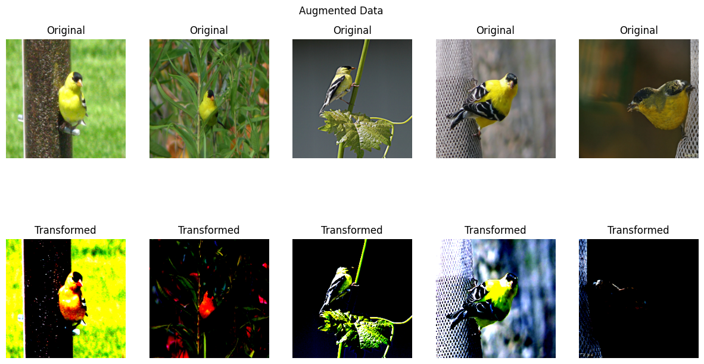
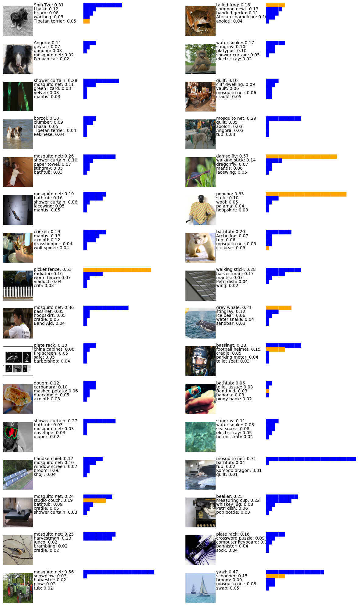

# AlexNet paper implementation on ImageNet


Network architecture of AlexNet.

In this experiment, we aimed to implement and evaluate the AlexNet architecture on the ImageNet dataset, focusing on various aspects such as data preprocessing, augmentation, and model performance, and presenting the results obtained in comparison to those reported in the paper 'ImageNet Classification with Deep Convolutional Neural Networks.'

### 1. Data Loading
The data set we have is adequate for the object localization problem, but the aim of our experiment is classification.
 ImageNet 2012 is available on kaggle and can be used directly: [ImageNet Object Localization Challenge 2012 on Kaggle](https://www.kaggle.com/competitions/imagenet-object-localization-challenge/data)

### 2. Data Preprocessing
The training dataset is well structured so we created a class mapping dictionary from a provided mapping file to facilitate the association of images with their respective classes. For the validation dataset, we mapped each image to its corresponding class using XML annotations. This involved extracting image names, parsing XML files to obtain class labels, and saving the results in a CSV file. 

### 2. Data Augmentation
We applied several transformations to enhance the dataset, including resizing images to 224x224 pixels, applying random horizontal and vertical flips, and introducing color jittering for brightness, contrast and Normalization was also performed to standardize pixel values.


Samples of images before and after augmentation


### 3. Training and Parameter hyperparameters configuration

We began by fine-tuning key hyperparameters critical to the training process:
- Batch Size: We used a batch size of 32.
- Optimization Algorithm: We employed SGD with momentum and weight decay to speed123
up convergence
- Regularization
- Learning Rate Scheduler


#### visualize filters learn by the first convolutional layer

96 convolutional kernels of size 11×11×1 and 11×11×3  learned by the first convolutional layer on the 224×224×3 input images.


#### Validation images and the five labels considered most probable by our model


the probability assigned to the correct label is shown with a green bar


### 4. Experimentation results

| Model                   | Top 1 Error (%) | Top 5 Error (%) |    GPU    | Time       | Epochs |
|-------------------------|-----------------|-----------------|-----------|------------|--------|
| AlexNet (Original)      |    40.7         | 18.2            |   2       |  6 Days    | 90     |
| AlexNet (Implementation)|    55.8         | 29.9            |   1       |58.6 Hours  | 22     |
| Ensemble Method (2 CNNs)|    54.4         | 29.3            |   1       |     -      |    -   |


Display  five labels considered most probable by our model




Thirty two ILSVRC-2012 test images and the five labels considered most probable by our model. The probability assigned to the correct label is shown with a orange bar (if it happens to be in the top 5).

### Project Structure 
- `utils`: This utility module includes functions in `data_preprocessing.py`, a training function in `train.py`, and an evaluation function in `evaluate.py`.
- `model`: This directory contains the `model.py` file, which defines the AlexNet architecture.
- `datasets`: This directory contains the `ImageNetDataset.py` file, which defines the ImageNetDataset class, which is a custom PyTorch dataset for loading and processing ImageNet images and their corresponding labels with optional transformations.
- `main.py`:This file sets up data transformations, loads datasets and model, and trains an AlexNet model on ImageNet data with specified configurations.

### Build With

**Language:** Python

**Package:** python-dotenv, seaborn, torchvision, matplotlib, Pytorch

### Run Locally

Clone the project
```bash
    git clone https://github.com/Omer-alt/AlexNet.git
```

Go to the project directory and run it.
```bash
    cd AlexNet
    python3 main.py
```

### Authors

- [@Fotso Omer](https://portfolio-omer-alt.vercel.app/)
- [@Duaa Alshareif](https://github.com/DuaaAlshareef)
- [@Aime Ouraga](https://github.com/aimeouraga)

### License

[MIT](https://choosealicense.com/licenses/mit/)