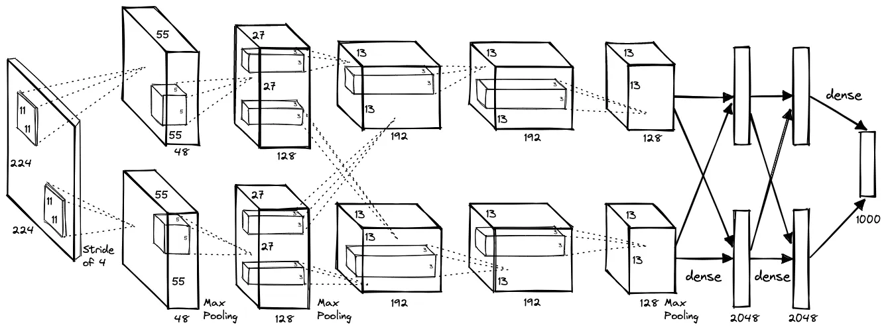
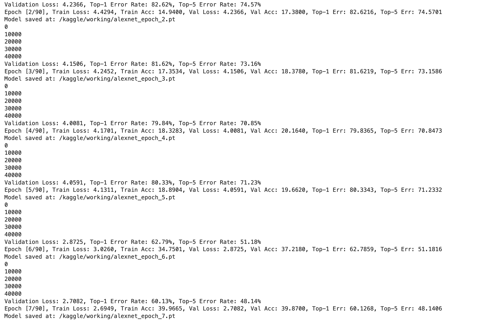

# AlexNet paper implementation on ImageNet


Network architecture of AlexNet.

In this experiment, we aimed to implement and evaluate the AlexNet architecture on the ImageNet dataset, focusing on various aspects such as data preprocessing, augmentation, and model performance.

### 1. Data Loading
The data set we have is adequate for the object localization problem, but the aim of our experiment is classification.ss
 ImageNet 2012 is available on kaggle and can be used directly: [ImageNet Object Localization Challenge 2012 on Kaggle](https://www.kaggle.com/competitions/imagenet-object-localization-challenge/data)

### 2. Data Preprocessing
The training dataset is well structured so we created a class mapping dictionary from a provided mapping file to facilitate the association of images with their respective classes. For the validation dataset, we mapped each image to its corresponding class using XML annotations. This involved extracting image names, parsing XML files to obtain class labels, and saving the results in a CSV file. 

### 2. Data Augmentation
We applied several transformations to enhance the dataset, including resizing images to 224x224 pixels, applying random horizontal and vertical flips, and introducing color jittering for brightness, contrast and Normalization was also performed to standardize pixel values.

### 3. Training and Parameter hyperparameters configuration


### 3. Experimentation results

| Model   | Top 1 Error (%) | Top 5 Error (%) | Time     | GPU | Epochs |
|---------|-----------------|-----------------|----------|-----|--------|
| CNN     | 37.5            | 17.0            | 6 Days   | 2   | 90     |
| AlexNet | 60.13           | 48.14           | 12 Hours | 1   | 7      |


**Result:** 
<!-- 
Network architecture of AlexNet. -->
The result on the complete dataset ILSVRC- 2012 run on Kaggle during 12 hours of time


### Build With

**Language:** Python

**Package:** python-dotenv, seaborn, torchvision, matplotlib, Pytorch

### Run Locally

Clone the project
```bash
    git clone https://github.com/Omer-alt/AlexNet.git
```

Go to the project directory and run it.
```bash
    cd AlexNet
    python3 main.py
```
### License

[MIT](https://choosealicense.com/licenses/mit/)